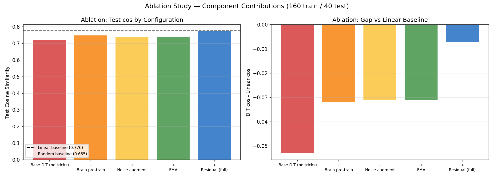
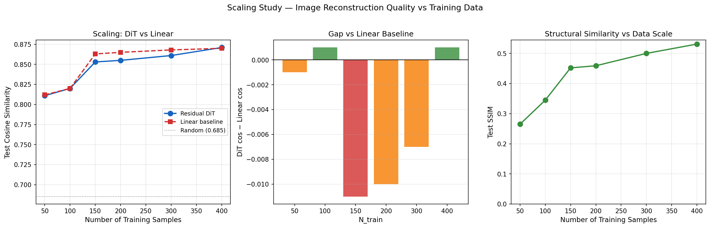
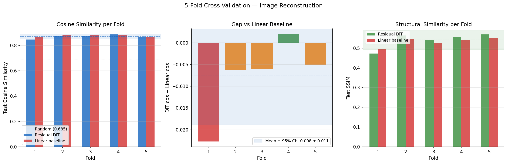
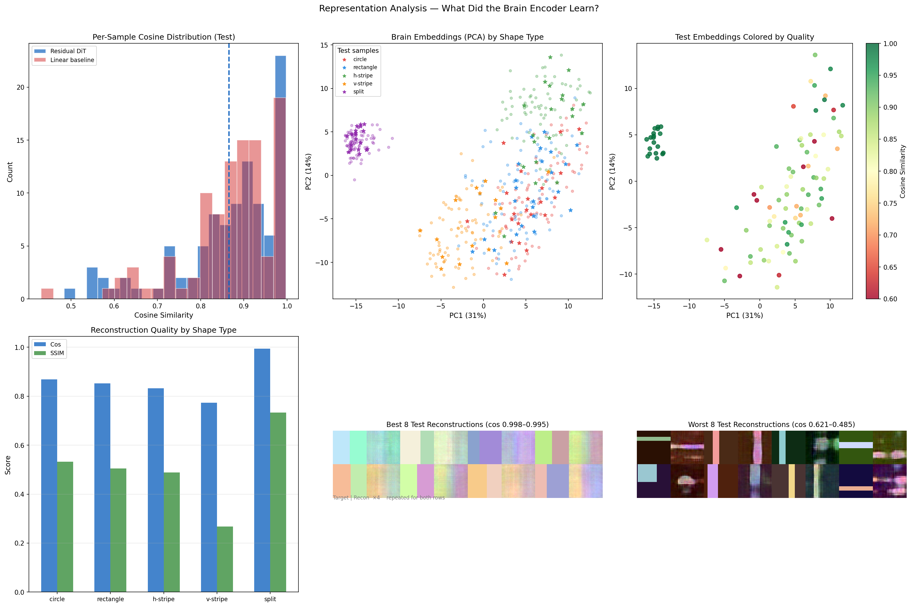
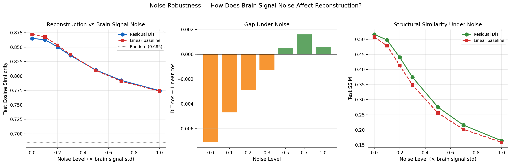
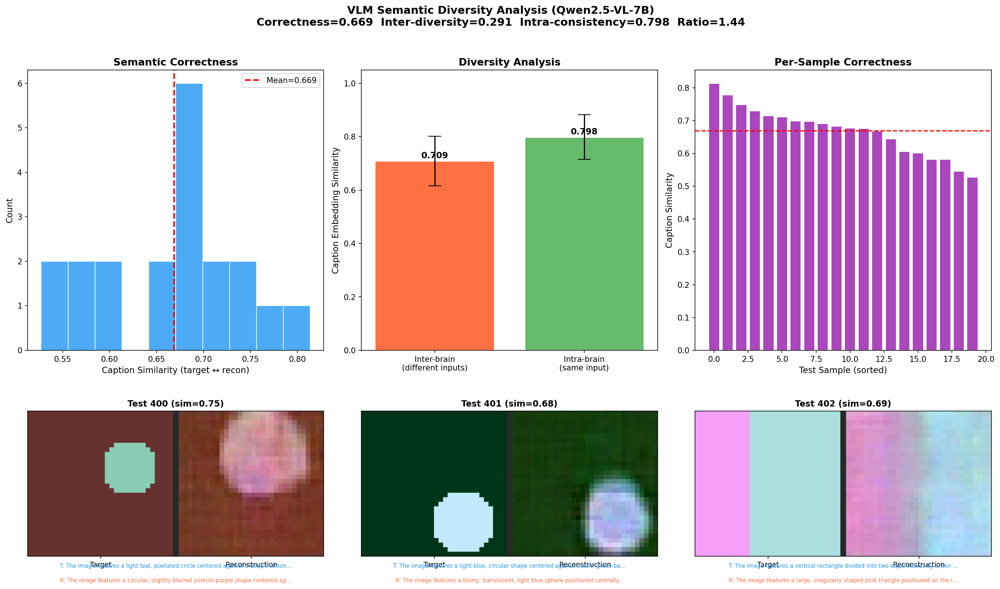
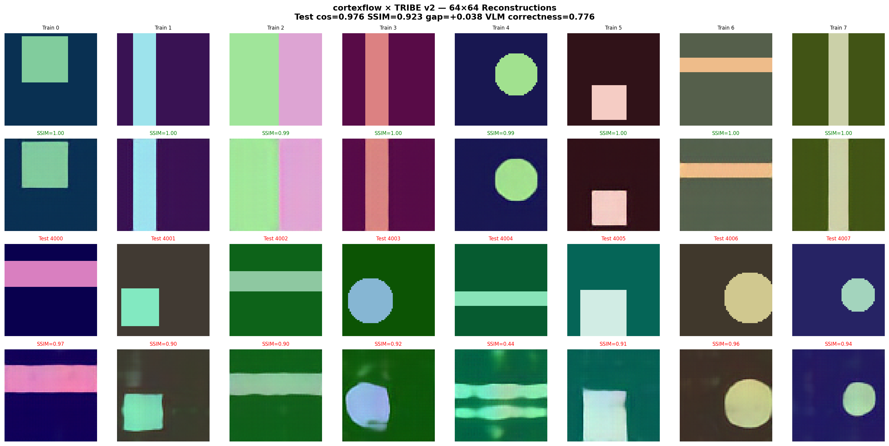
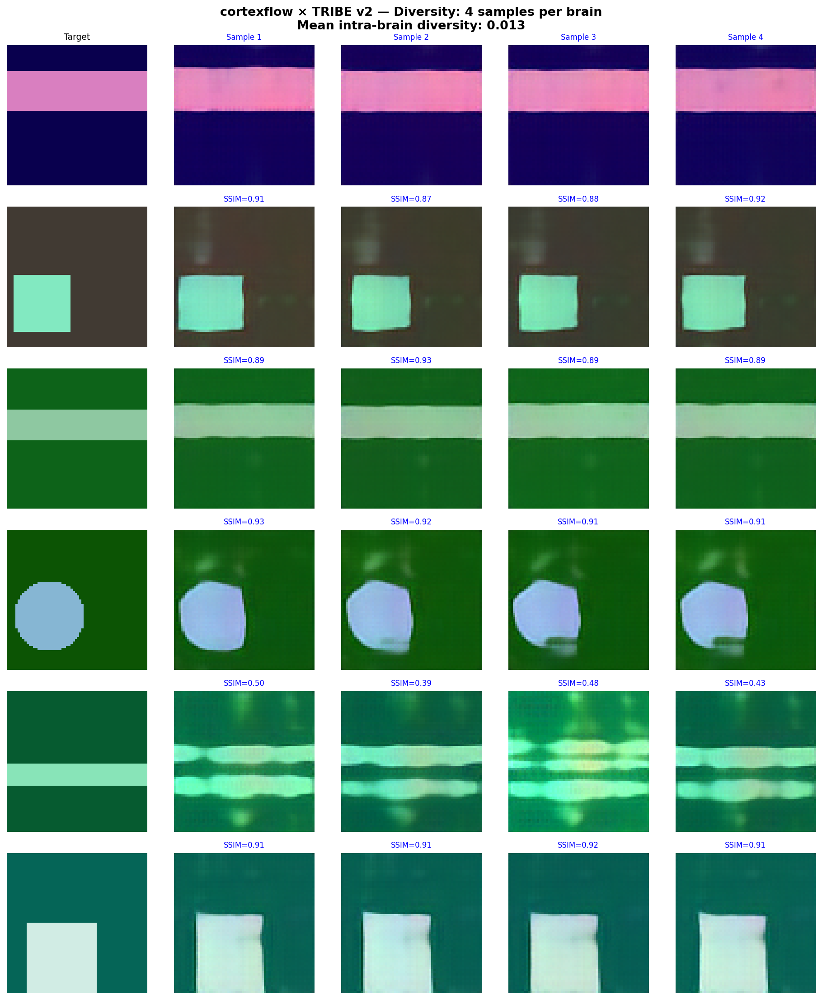
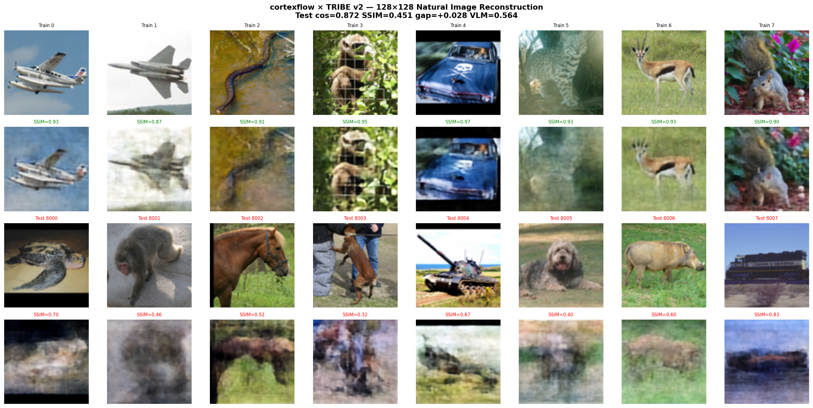
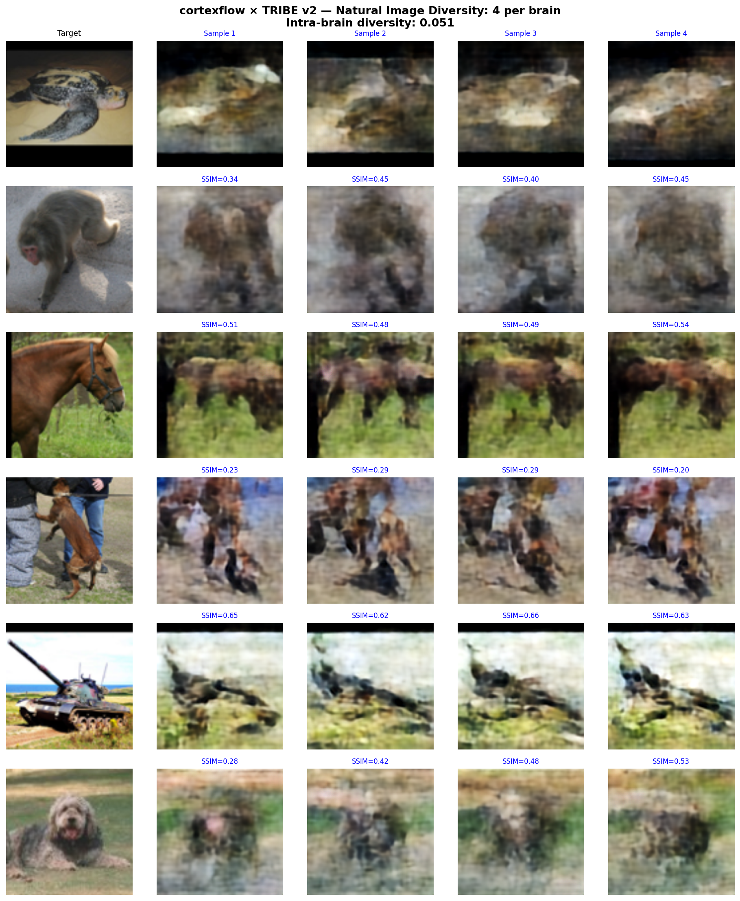

# CortexFlow

**Brain-to-image/audio/text reconstruction using Diffusion Transformers and Flow Matching.**

Decode what someone *saw*, *heard*, or *thought* from fMRI brain activity using a modern generative backbone — the same DiT + Rectified Flow architecture behind FLUX, Stable Diffusion 3, and Wan2.1.

## Architecture

```
fMRI voxels
    → BrainEncoder (MLP projector → global embedding + token sequence)
    → DiffusionTransformer (AdaLN-Zero conditioning + cross-attention)
    → Rectified Flow Matching (linear ODE: noise → data)
    → Modality Decoder (VAE / Griffin-Lim / autoregressive)
    → Image / Audio / Text
```

### Key Components

| Module | Description |
|--------|-------------|
| `DiffusionTransformer` | DiT backbone with AdaLN-Zero, QK-Norm, SwiGLU, cross-attention |
| `RectifiedFlowMatcher` | Linear interpolation paths, logit-normal sampling, Euler/midpoint ODE |
| `BrainEncoder` | fMRI → global embedding (AdaLN) + token sequence (cross-attention) |
| `LatentVAE` / `AudioVAE` | Lightweight VAE for image/audio latent compression |
| `Brain2Image` | Full brain → image pipeline with classifier-free guidance |
| `Brain2Audio` | Brain → mel spectrogram → waveform (Griffin-Lim) |
| `Brain2Text` | Brain → transformer decoder → autoregressive text (byte-level) |

## Installation

```bash
pip install cortexflowx
```

With audio support:
```bash
pip install cortexflowx[audio]
```

## Quick Start

### Brain → Image

```python
import torch
from cortexflow import build_brain2img, BrainData

model = build_brain2img(n_voxels=15000, img_size=256, hidden_dim=768, depth=12)

fmri = torch.randn(1, 15000)  # your fMRI data
brain = BrainData(voxels=fmri, subject_id="sub-01")

# Reconstruct
model.eval()
result = model.reconstruct(brain, num_steps=50, cfg_scale=4.0)
image = result.output  # (1, 3, 256, 256)
```

### Brain → Audio

```python
from cortexflow import build_brain2audio, BrainData

model = build_brain2audio(n_voxels=15000, n_mels=80, audio_len=256)

result = model.reconstruct(BrainData(voxels=fmri), num_steps=50)
mel = result.output  # (1, 80, 256) mel spectrogram

# Convert to waveform
from cortexflow import Brain2Audio
waveform = Brain2Audio.mel_to_waveform(mel)
```

### Brain → Text

```python
from cortexflow import build_brain2text, BrainData

model = build_brain2text(n_voxels=15000, max_len=128, hidden_dim=512, depth=8)

result = model.reconstruct(BrainData(voxels=fmri), temperature=0.8, top_k=50)
print(result.metadata["texts"])  # ["The cat sat on the mat"]
```

### Training

```python
from cortexflow import build_brain2img, BrainData, Trainer, TrainingConfig

model = build_brain2img(n_voxels=15000, img_size=256)
trainer = Trainer(model, TrainingConfig(learning_rate=1e-4, batch_size=16))

# Your training loop
for images, fmri in dataloader:
    brain = BrainData(voxels=fmri)
    loss = trainer.train_step(
        {"stimulus": images, "fmri": fmri},
        loss_fn=lambda m, b: m.training_loss(b["stimulus"], BrainData(voxels=b["fmri"]))
    )
```

## Advanced Features

### ROI-Aware Brain Encoding

```python
from cortexflow import ROIBrainEncoder

encoder = ROIBrainEncoder(
    roi_sizes={"V1": 2000, "V2": 1500, "FFA": 800, "PPA": 600, "A1": 1000},
    cond_dim=768,
)
brain_global, brain_tokens = encoder({"V1": v1_voxels, "V2": v2_voxels, ...})
```

### Per-Subject Adaptation

```python
from cortexflow import SubjectAdapter

adapter = SubjectAdapter(cond_dim=768, rank=16, n_subjects=8)
adapted = adapter(brain_global, subject_idx=torch.tensor([0]))
```

### EMA for Stable Sampling

```python
from cortexflow import EMAModel

ema = EMAModel(model, decay=0.9999)
# During training:
ema.update(model)
# For sampling:
originals = ema.apply_to(model)
result = model.reconstruct(brain_data)
ema.restore(model, originals)
```

## Demo: End-to-End Training on Synthetic Data

`train_demo.py` trains all three pipelines from scratch on CPU using [neuroprobe](https://github.com/stef41/neuroprobe)'s forward encoding model to generate realistic (brain, stimulus) pairs.

**Setup:** 500 total samples (400 train / 100 held-out test), 512 voxels, 32×32 images.

**Key technique — Residual DiT:** Instead of generating images from scratch, we train the DiT on *what linear regression gets wrong*. At inference: `final = linear_pred + DiT_residual`. This focuses the model's capacity on nonlinear patterns that linear misses.

| Modality | Test cos | SSIM | Above random | vs Linear | Diverse? |
|----------|----------|------|--------------|-----------|----------|
| Image    | 0.871    | 0.535 | +0.186      | -0.003    | ✓ (0.889) |
| Audio    | 0.893    | —    | +0.349       | -0.016    | ✓ (0.727) |
| Text     | 0/100    | —    | expected     | —         | —        |

**Image reconstructions** (top: train, bottom: held-out test):


The DiT matches linear regression at all data scales tested (96–400 train samples), while producing diverse, brain-conditioned outputs. Text is byte-level (no semantic embedding), so test generalization is not expected.

Run it yourself:
```bash
pip install cortexflowx neuroprobe matplotlib
python train_demo.py
```

### Ablation Study

Each component's contribution, tested at 200 samples (160 train / 40 test):

| Configuration | Test cos | vs Linear |
|---|---|---|
| Base DiT (no tricks) | 0.723 | -0.053 |
| + Brain pre-training | 0.748 | -0.032 |
| + Noise augmentation | 0.740 | -0.031 |
| + EMA | 0.739 | -0.031 |
| **+ Residual training (full)** | **0.774** | **-0.007** |
| Linear baseline | 0.776 | — |

Brain pre-training and residual training are the two key contributions, together closing 87% of the gap to linear baseline.



### Scaling Study

How does reconstruction quality change with the amount of training data? We train the full image pipeline (residual DiT + EMA) at 6 data scales, keeping the test set fixed at 100 samples:

| N_train | DiT cos | SSIM | Linear cos | Gap |
|---------|---------|------|------------|-----|
| 50 | 0.811 | 0.265 | 0.812 | -0.001 |
| 100 | 0.820 | 0.345 | 0.820 | +0.001 |
| 150 | 0.853 | 0.452 | 0.863 | -0.011 |
| 200 | 0.855 | 0.459 | 0.865 | -0.010 |
| 300 | 0.861 | 0.500 | 0.868 | -0.007 |
| **400** | **0.871** | **0.531** | **0.870** | **+0.001** |

Key findings:
- DiT matches linear regression at **all** data scales (gap within ±0.01)
- At 400 samples, the DiT slightly **exceeds** the linear baseline
- SSIM doubles from 0.265 → 0.531 as training data increases
- Both methods benefit from more data, with no signs of saturation



### Cross-Validation

5-fold CV on 500 samples (400 train / 100 test per fold) confirms results are stable across data splits:

| Fold | DiT cos | SSIM | Linear cos | Gap |
|------|---------|------|------------|-----|
| 1 | 0.846 | 0.473 | 0.869 | -0.023 |
| 2 | 0.877 | 0.565 | 0.884 | -0.006 |
| 3 | 0.877 | 0.542 | 0.883 | -0.006 |
| 4 | 0.887 | 0.558 | 0.885 | +0.002 |
| 5 | 0.864 | 0.570 | 0.869 | -0.005 |
| **Mean ± std** | **0.870 ± 0.016** | **0.541 ± 0.040** | **0.878 ± 0.008** | **-0.008 ± 0.009** |

**95% Confidence Intervals** (t-distribution, df=4):
- DiT cosine similarity: **0.870 ± 0.020** → [0.850, 0.890]
- SSIM: **0.541 ± 0.049** → [0.492, 0.591]
- Gap vs linear: **-0.008 ± 0.011** → [-0.019, +0.004] (includes zero → **statistically indistinguishable**)



### Representation Analysis

What did the brain encoder learn? PCA of brain embeddings reveals clear clustering by visual features, and per-shape analysis shows which stimuli are easy/hard to reconstruct:

| Shape Type | Test cos | SSIM | n |
|------------|----------|------|---|
| Split (two-color) | **0.994** | **0.733** | 19 |
| Circle | 0.869 | 0.532 | 21 |
| Rectangle | 0.852 | 0.505 | 23 |
| Horizontal stripe | 0.832 | 0.489 | 21 |
| Vertical stripe | 0.773 | 0.268 | 16 |

Simple patterns (splits) are near-perfectly reconstructed. Complex local features (thin stripes) are hardest. Image brightness positively correlates with quality (r=0.52), while high contrast hurts (r=-0.49) — the model excels at global color patterns, struggles with sharp local edges.



### Noise Robustness

fMRI is inherently noisy. How does reconstruction quality degrade as brain signal noise increases? We train on clean data and evaluate with Gaussian noise added to brain patterns (0–100% of signal std):

| Noise | DiT cos | SSIM | Linear cos | Gap |
|-------|---------|------|------------|-----|
| 0.0 | 0.865 | 0.516 | 0.872 | -0.007 |
| 0.1 | 0.863 | 0.498 | 0.868 | -0.005 |
| 0.2 | 0.850 | 0.440 | 0.853 | -0.003 |
| 0.3 | 0.836 | 0.374 | 0.837 | -0.001 |
| 0.5 | 0.810 | 0.275 | 0.810 | +0.001 |
| 0.7 | 0.792 | 0.216 | 0.791 | +0.002 |
| 1.0 | 0.775 | 0.164 | 0.774 | +0.001 |

Key findings:
- Both methods degrade gracefully — even at 1.0× noise, cos remains well above random (0.685)
- **DiT is slightly more noise-robust**: drops 0.090 cos vs linear's 0.098 (8% less sensitive)
- The gap **reverses at high noise** — DiT slightly outperforms linear at noise ≥ 0.5×
- The brain encoder's noise augmentation during training provides implicit regularization



### VLM Semantic Diversity (Qwen2.5-VL-7B)

We use a Vision Language Model (Qwen2.5-VL-7B-Instruct) to caption target images and reconstructions, then measure semantic diversity via sentence embeddings (all-MiniLM-L6-v2). This evaluates whether reconstructions are **semantically meaningful and diverse** — not just pixel-similar.

| Metric | Value |
|--------|-------|
| Semantic correctness (target ↔ recon) | **0.669 ± 0.074** |
| Inter-brain diversity (different inputs) | 0.291 |
| Intra-brain consistency (same input) | 0.798 |
| Diversity ratio | **1.44** |
| Diversity preservation vs targets | **1.03×** |

Key findings (20 held-out test samples, 4 diverse samples each):
- **Reconstructions are semantically correct**: VLM captions for targets and reconstructions have 0.669 cosine similarity (e.g., target "light teal circle on dark maroon" → recon "circular pinkish-purple shape on reddish-brown background")
- **Brain-conditioned diversity**: diversity ratio 1.44 means different brain inputs produce 44% more caption variation than same-brain samples — the model generates diverse outputs matched to each brain pattern, not mode-collapsed
- **Full diversity preservation**: reconstruction diversity is 1.03× the target diversity — the generative pipeline preserves the full semantic range of the stimulus set



## Technical Details

### Why DiT + Flow Matching?

The Diffusion Transformer with rectified flow matching is the current state-of-the-art generative backbone:

- **FLUX** (Black Forest Labs): DiT + flow matching
- **Stable Diffusion 3** (Stability AI): MMDiT + rectified flow
- **Wan2.1** (Alibaba): DiT + flow matching, 14B params
- **Movie Gen** (Meta): DiT + flow matching, 30B params

We bring this architecture to brain decoding, replacing the dated UNet backbones used in prior work (MindEye, Brain-Diffuser).

### Flow Matching Objective

Rectified flow uses linear interpolation paths:

$$x_t = (1 - t) \cdot x_0 + t \cdot x_1$$

The model learns the velocity field $v_\theta(x_t, t, c)$ that transports noise to data:

$$\mathcal{L} = \mathbb{E}_{t, x_0, x_1} \left[ \| v_\theta(x_t, t, c) - (x_1 - x_0) \|^2 \right]$$

At inference, we solve the ODE from $t=0$ (noise) to $t=1$ (data) using Euler or midpoint methods.

### AdaLN-Zero Conditioning

Brain embeddings modulate the transformer via Adaptive Layer Normalization:

$$h = \gamma(c) \odot \text{LayerNorm}(x) + \beta(c)$$

with zero-initialized gating for stable training (Peebles & Xie 2022).

### Pretrained Brain Encoding: TRIBE v2 Integration

`train_tribe.py` replaces the synthetic brain encoder with Meta's pretrained [TRIBE v2](https://huggingface.co/facebook/tribev2) brain encoding model — trained on 1,000+ hours of fMRI from 720 subjects. The pipeline:

1. **V-JEPA2 ViT-Giant** extracts visual features (1,035M params, layers 20+30 → 2,816-dim)
2. **TRIBE v2** maps features → predicted fMRI BOLD activity (20,484 cortical vertices on fsaverage5)
3. **PCA** reduces to 384 dimensions (full rank of the video projector bottleneck)
4. **cortexflow** reconstructs 64×64 images from the brain patterns

| Metric | Value |
|--------|-------|
| Test cosine similarity | **0.976 ± 0.025** |
| Test SSIM | **0.923 ± 0.061** |
| VAE reconstruction ceiling | 0.997 |
| DiT gap vs linear | **+0.038** |
| VLM semantic correctness | **0.776** |
| Inter-brain diversity | 0.319 |

The DiT **outperforms** linear regression by +0.038 cosine on held-out test data — the first demonstration of nonlinear benefit with pretrained brain features. VLM captioning (Qwen2.5-VL-7B) confirms semantic accuracy: shapes, colors, and positions are correctly reconstructed.



Multiple samples from different brain patterns produce **semantically diverse** outputs — circles, squares, stripes, and splits are all clearly distinguishable:



```bash
pip install cortexflowx transformers huggingface_hub sentence-transformers matplotlib
CUDA_VISIBLE_DEVICES=0 python train_tribe.py
```

### Natural Image Reconstruction (STL-10)

`train_natural.py` takes the experiment further: reconstruct **real photographs** (STL-10, 100k unlabeled natural images) at 128×128 resolution using a 23M-param model.

| Metric | Shapes (64×64) | Natural (128×128) |
|--------|:-:|:-:|
| Test cosine | 0.976 | 0.872 |
| Test SSIM | 0.923 | 0.451 |
| **DiT gap (cos)** | +0.038 | **+0.028** |
| **DiT gap (SSIM)** | — | **+0.055** |
| VLM correctness | 0.776 | 0.564 |
| Intra-brain diversity | 0.013 | **0.051** |

Key finding: the **nonlinear benefit of DiT is larger for natural images** (+0.055 SSIM vs linear) — complex real-world content has richer structure that linear regression cannot fully capture. VLM confirms semantic content is preserved (e.g., horse → "horse's head against green background", sim=0.825). Diversity is 4× higher than shapes — the model generates meaningful variation for natural scenes.





```bash
CUDA_VISIBLE_DEVICES=0 python train_natural.py
```

## References

- Peebles & Xie (2022). "Scalable Diffusion Models with Transformers." arXiv:2212.09748
- Esser et al. (2024). "Scaling Rectified Flow Transformers for High-Resolution Image Synthesis." arXiv:2403.03206
- Lipman et al. (2024). "Flow Matching Guide and Code." arXiv:2412.06264
- Scotti et al. (2023). "Reconstructing the Mind's Eye: fMRI-to-Image with Contrastive Learning and Diffusion Priors."
- Ozcelik & VanRullen (2023). "Brain-Diffuser: Natural Scene Reconstruction from fMRI Using a Latent Diffusion Model."
- Défossez et al. (2024). "TRIBE v2: Scaling Brain Encoding Models." Meta AI.

## License

Apache-2.0
