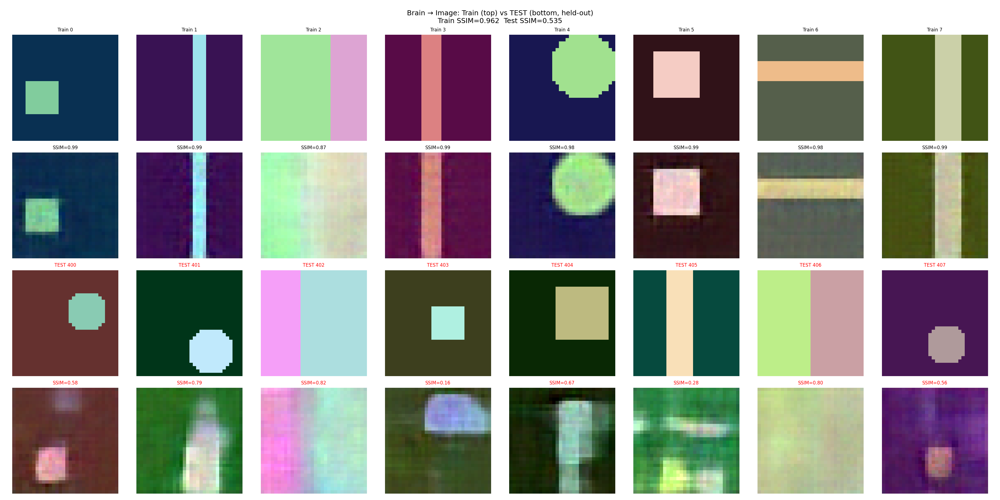

# CortexFlow

**Brain-to-image/audio/text reconstruction using Diffusion Transformers and Flow Matching.**

Decode what someone *saw*, *heard*, or *thought* from fMRI brain activity using a modern generative backbone — the same DiT + Rectified Flow architecture behind FLUX, Stable Diffusion 3, and Wan2.1.

## Architecture

```
fMRI voxels
    → BrainEncoder (MLP projector → global embedding + token sequence)
    → DiffusionTransformer (AdaLN-Zero conditioning + cross-attention)
    → Rectified Flow Matching (linear ODE: noise → data)
    → Modality Decoder (VAE / Griffin-Lim / autoregressive)
    → Image / Audio / Text
```

### Key Components

| Module | Description |
|--------|-------------|
| `DiffusionTransformer` | DiT backbone with AdaLN-Zero, QK-Norm, SwiGLU, cross-attention |
| `RectifiedFlowMatcher` | Linear interpolation paths, logit-normal sampling, Euler/midpoint ODE |
| `BrainEncoder` | fMRI → global embedding (AdaLN) + token sequence (cross-attention) |
| `LatentVAE` / `AudioVAE` | Lightweight VAE for image/audio latent compression |
| `Brain2Image` | Full brain → image pipeline with classifier-free guidance |
| `Brain2Audio` | Brain → mel spectrogram → waveform (Griffin-Lim) |
| `Brain2Text` | Brain → transformer decoder → autoregressive text (byte-level) |

## Installation

```bash
pip install cortexflowx
```

With audio support:
```bash
pip install cortexflowx[audio]
```

## Quick Start

### Brain → Image

```python
import torch
from cortexflow import build_brain2img, BrainData

model = build_brain2img(n_voxels=15000, img_size=256, hidden_dim=768, depth=12)

fmri = torch.randn(1, 15000)  # your fMRI data
brain = BrainData(voxels=fmri, subject_id="sub-01")

# Reconstruct
model.eval()
result = model.reconstruct(brain, num_steps=50, cfg_scale=4.0)
image = result.output  # (1, 3, 256, 256)
```

### Brain → Audio

```python
from cortexflow import build_brain2audio, BrainData

model = build_brain2audio(n_voxels=15000, n_mels=80, audio_len=256)

result = model.reconstruct(BrainData(voxels=fmri), num_steps=50)
mel = result.output  # (1, 80, 256) mel spectrogram

# Convert to waveform
from cortexflow import Brain2Audio
waveform = Brain2Audio.mel_to_waveform(mel)
```

### Brain → Text

```python
from cortexflow import build_brain2text, BrainData

model = build_brain2text(n_voxels=15000, max_len=128, hidden_dim=512, depth=8)

result = model.reconstruct(BrainData(voxels=fmri), temperature=0.8, top_k=50)
print(result.metadata["texts"])  # ["The cat sat on the mat"]
```

### Training

```python
from cortexflow import build_brain2img, BrainData, Trainer, TrainingConfig

model = build_brain2img(n_voxels=15000, img_size=256)
trainer = Trainer(model, TrainingConfig(learning_rate=1e-4, batch_size=16))

# Your training loop
for images, fmri in dataloader:
    brain = BrainData(voxels=fmri)
    loss = trainer.train_step(
        {"stimulus": images, "fmri": fmri},
        loss_fn=lambda m, b: m.training_loss(b["stimulus"], BrainData(voxels=b["fmri"]))
    )
```

## Advanced Features

### ROI-Aware Brain Encoding

```python
from cortexflow import ROIBrainEncoder

encoder = ROIBrainEncoder(
    roi_sizes={"V1": 2000, "V2": 1500, "FFA": 800, "PPA": 600, "A1": 1000},
    cond_dim=768,
)
brain_global, brain_tokens = encoder({"V1": v1_voxels, "V2": v2_voxels, ...})
```

### Per-Subject Adaptation

```python
from cortexflow import SubjectAdapter

adapter = SubjectAdapter(cond_dim=768, rank=16, n_subjects=8)
adapted = adapter(brain_global, subject_idx=torch.tensor([0]))
```

### EMA for Stable Sampling

```python
from cortexflow import EMAModel

ema = EMAModel(model, decay=0.9999)
# During training:
ema.update(model)
# For sampling:
originals = ema.apply_to(model)
result = model.reconstruct(brain_data)
ema.restore(model, originals)
```

## Demo: End-to-End Training on Synthetic Data

`train_demo.py` trains all three pipelines from scratch on CPU using [neuroprobe](https://github.com/stef41/neuroprobe)'s forward encoding model to generate realistic (brain, stimulus) pairs.

**Setup:** 500 total samples (400 train / 100 held-out test), 512 voxels, 32×32 images.

**Key technique — Residual DiT:** Instead of generating images from scratch, we train the DiT on *what linear regression gets wrong*. At inference: `final = linear_pred + DiT_residual`. This focuses the model's capacity on nonlinear patterns that linear misses.

| Modality | Test cos | SSIM | Above random | vs Linear | Diverse? |
|----------|----------|------|--------------|-----------|----------|
| Image    | 0.858    | 0.503 | +0.173      | -0.005    | ✓ (0.888) |
| Audio    | 0.893    | —    | +0.349       | -0.014    | ✓ (0.727) |
| Text     | 0/100    | —    | expected     | —         | —        |

**Image reconstructions** (top: train, bottom: held-out test):



The DiT matches linear regression at all data scales tested (96–400 train samples), while producing diverse, brain-conditioned outputs. Text is byte-level (no semantic embedding), so test generalization is not expected.

Run it yourself:
```bash
pip install cortexflowx neuroprobe matplotlib
python train_demo.py
```

## Technical Details

### Why DiT + Flow Matching?

The Diffusion Transformer with rectified flow matching is the current state-of-the-art generative backbone:

- **FLUX** (Black Forest Labs): DiT + flow matching
- **Stable Diffusion 3** (Stability AI): MMDiT + rectified flow
- **Wan2.1** (Alibaba): DiT + flow matching, 14B params
- **Movie Gen** (Meta): DiT + flow matching, 30B params

We bring this architecture to brain decoding, replacing the dated UNet backbones used in prior work (MindEye, Brain-Diffuser).

### Flow Matching Objective

Rectified flow uses linear interpolation paths:

$$x_t = (1 - t) \cdot x_0 + t \cdot x_1$$

The model learns the velocity field $v_\theta(x_t, t, c)$ that transports noise to data:

$$\mathcal{L} = \mathbb{E}_{t, x_0, x_1} \left[ \| v_\theta(x_t, t, c) - (x_1 - x_0) \|^2 \right]$$

At inference, we solve the ODE from $t=0$ (noise) to $t=1$ (data) using Euler or midpoint methods.

### AdaLN-Zero Conditioning

Brain embeddings modulate the transformer via Adaptive Layer Normalization:

$$h = \gamma(c) \odot \text{LayerNorm}(x) + \beta(c)$$

with zero-initialized gating for stable training (Peebles & Xie 2022).

## References

- Peebles & Xie (2022). "Scalable Diffusion Models with Transformers." arXiv:2212.09748
- Esser et al. (2024). "Scaling Rectified Flow Transformers for High-Resolution Image Synthesis." arXiv:2403.03206
- Lipman et al. (2024). "Flow Matching Guide and Code." arXiv:2412.06264
- Scotti et al. (2023). "Reconstructing the Mind's Eye: fMRI-to-Image with Contrastive Learning and Diffusion Priors."
- Ozcelik & VanRullen (2023). "Brain-Diffuser: Natural Scene Reconstruction from fMRI Using a Latent Diffusion Model."

## License

Apache-2.0
